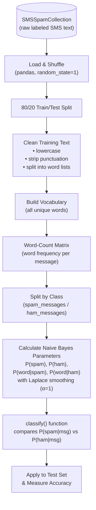

# SMS Spam Filter (Multinomial Naive Bayes, Built From Scratch)

A spam classifier for SMS text messages, implemented from first principles in Python — no `scikit-learn`, just `pandas` and probability math.

> **Note:** This is a learning/course project. The model is intentionally implemented manually (rather than via a library like scikit-learn) to demonstrate understanding of how Naive Bayes classification actually works under the hood.

---

## Business Problem

Spam text messages are more than an annoyance — they're a vector for phishing, scams, and fraud, and at scale they degrade trust in SMS as a communication channel for legitimate businesses (banks, delivery services, two-factor auth, etc.). Carriers, messaging platforms, and businesses that send/receive SMS at volume need an automated way to **flag likely-spam messages without a human reading every single text**.

This project addresses that with a **Multinomial Naive Bayes classifier**: given the words in a message, estimate the probability that the message is spam vs. legitimate ("ham"), and label it automatically. The goal is to show that even a relatively simple, transparent statistical model — built without a machine learning library — can catch the large majority of spam with minimal false classification.

---

## Dataset

This project uses the **[SMS Spam Collection v.1](http://www.dt.fee.unicamp.br/~tiago/smsspamcollection/)**, a public research dataset of 5,574 real SMS messages labeled as `ham` (legitimate) or `spam`.

- **Class balance:** ~86.6% ham / ~13.4% spam
- **Format:** tab-separated text file (`SMSSpamCollection`), one message per line: `<label>\t<message text>`
- **Sources:** compiled from the Grumbletext UK spam-reporting forum, Caroline Tagg's PhD thesis corpus, the NUS SMS Corpus, and the SMS Spam Corpus v.0.1 (José María Gómez Hidalgo)
- **Citation:** Almeida, T.A., Gómez Hidalgo, J.M., Yamakami, A. *Contributions to the Study of SMS Spam Filtering: New Collection and Results.* ACM DOCENG'11.

**To obtain the data:** download `SMSSpamCollection` from the [UCI Machine Learning Repository](https://archive.ics.uci.edu/dataset/228/sms+spam+collection) and place it in the project root (the notebook reads it as `pd.read_csv('SMSSpamCollection', sep='\t', header=None, names=['Label', 'SMS'])`).

⚠️ The dataset is provided for research use only — see the original corpus license before any commercial use.

---

## Technologies Used

- **Python 3**
- **pandas** — data loading, cleaning, and the word-count matrix
- **re** (regular expressions) — stripping non-alphanumeric characters from message text
- **string** — punctuation removal
- **Jupyter Notebook** — development environment (`filter.ipynb`)

No machine learning library is used — the Naive Bayes math (probabilities, Laplace smoothing) is implemented manually with plain Python and pandas.

---

## Architecture



**How classification works:**
1. An incoming message is cleaned (lowercased, punctuation stripped) and split into words.
2. Starting from the baseline probabilities `P(spam)` and `P(ham)`, the model multiplies in `P(word|spam)` and `P(word|ham)` for every word in the message that exists in the training vocabulary.
3. **Laplace smoothing** (α = 1) is applied so that words unseen in training don't zero out a probability.
4. Whichever resulting probability is higher determines the label. If the two probabilities are exactly equal, the message is flagged for human review.

---

## Setup and Execution

### Prerequisites
- Python 3.8+
- Jupyter Notebook or JupyterLab

### Installation

```bash
pip install pandas jupyter
```

### Running the model

1. Download the `SMSSpamCollection` file (see [Dataset](#dataset) above) and place it in the same directory as the notebook.
2. Launch Jupyter:
   ```bash
   jupyter notebook
   ```
3. Open `filter.ipynb` and run all cells in order. The notebook will:
   - Load and shuffle the dataset, then split it 80/20 into training and test sets
   - Clean the training text and build the vocabulary
   - Calculate Naive Bayes parameters (with Laplace smoothing) for every word
   - Classify the held-out test set and report accuracy

### Classifying a new message

Once the notebook has run, you can classify any string directly:

```python
classify('WINNER!! This is the secret code to unlock the money: C3421.')
# P(Spam|message): ...
# P(Ham|message): ...
# Label: Spam (or Ham)
```

---

## Sample Output

**Model performance on the held-out test set (1,114 messages):**

```
Correct:   1069
Incorrect: 45
Accuracy:  0.9596  (≈ 96%)
```

**Example classifications:**

| Message | Predicted |
|---|---|
| "Later i guess. I needa do mcat study too." | ham |
| "Had your mobile 10 mths? Update to latest Orange..." | spam |
| "WINNER!! This is the secret code to unlock the money: C3421." | spam |
| "Sounds good, Tom, then see u there" | ham |

*(Add a screenshot of the notebook's output cells here if you'd like a visual alongside the table.)*

---

## Key Findings and Lessons Learned

- **A from-scratch Naive Bayes model performs strongly even without a library.** ~96% accuracy on the held-out test set shows that the core math behind spam filtering isn't mysterious — `scikit-learn` automates these same steps (vocabulary building, conditional probabilities, Laplace smoothing) rather than doing something fundamentally different.
- **Class imbalance carried through cleanly.** The ~87/13 ham/spam split in the full dataset was preserved closely in both the training set (86.5/13.5) and test set (86.8/13.2) after shuffling — important, since a skewed split could bias the learned probabilities.
- **Text cleaning matters before counting.** Lowercasing and stripping punctuation before building the vocabulary avoids treating `"Winner"`, `"winner,"`, and `"WINNER!!"` as three different words — without this step, the word-probability tables would be needlessly sparse.
- **Laplace smoothing is what keeps the model usable in practice.** Without the `+1` smoothing term, any test message containing a word never seen in training would multiply a probability by zero — silently breaking the classifier. The smoothing constant (α = 1) prevents that.
- **Equal-probability messages are a known edge case.** The classifier explicitly handles the (rare) case where `P(spam|message) == P(ham|message)` by flagging the message for human review rather than guessing.

---

## Possible Extensions

- Compare this from-scratch implementation's accuracy/speed against `scikit-learn`'s `MultinomialNB` on the same train/test split
- Add precision, recall, and a confusion matrix (accuracy alone hides false positive/negative tradeoffs — especially relevant for spam, where blocking a real message is costlier than missing a spam one)
- Experiment with different smoothing values (α) or minimum word-frequency thresholds to shrink the vocabulary
- Package `classify()` into a small CLI or API for testing arbitrary messages without opening the notebook
